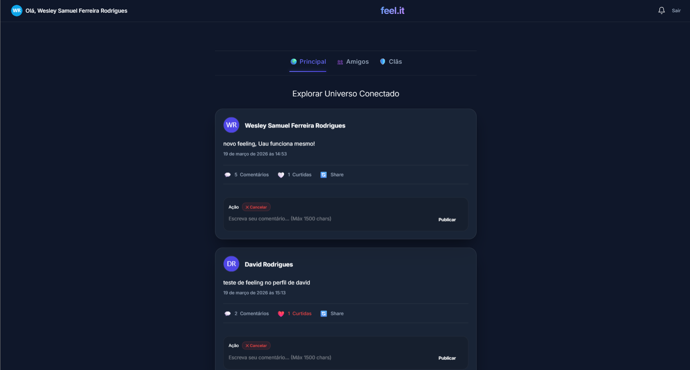
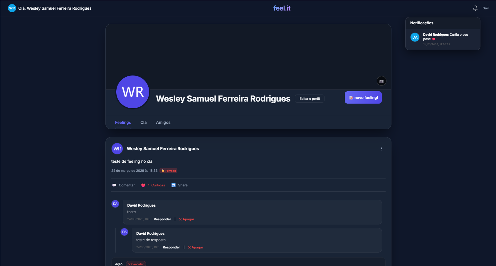
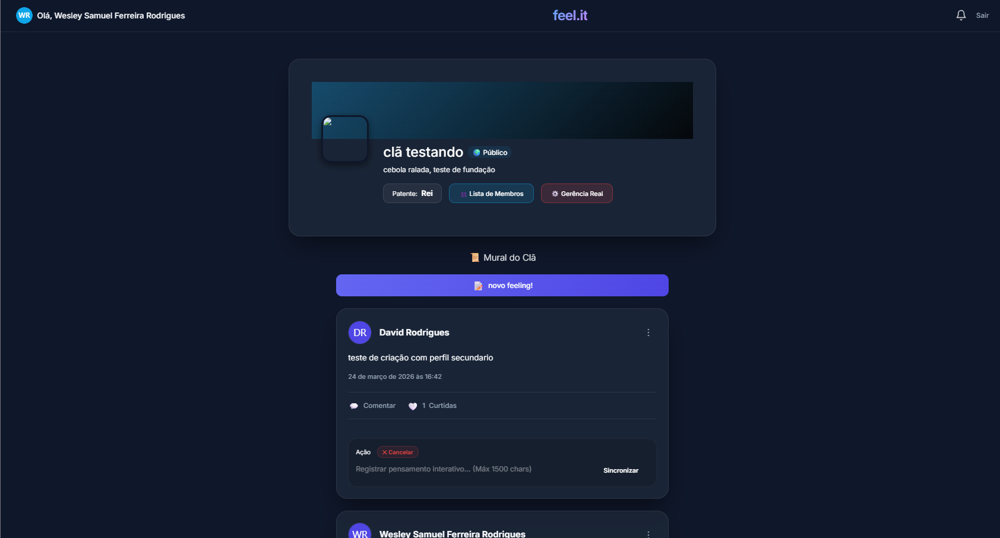
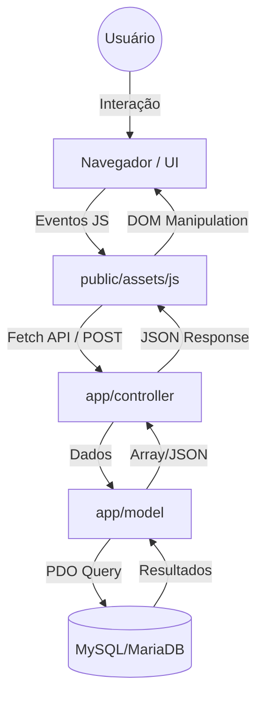
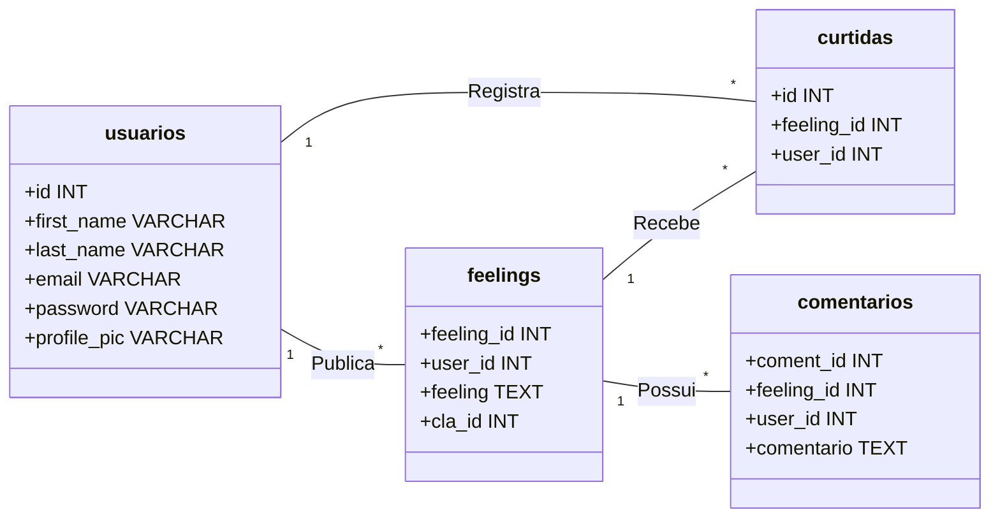

# Kurta - feel.it 💎

<p align="center">
  
  
  
  
</p>

O **Kurta (feel.it)** é uma plataforma de rede social moderna, focada em conexões autênticas e comunidades dinâmicas (**Clãs**). Com uma estética **Glassmorphism** premium e uma arquitetura robusta baseada em **PHP MVC**, o projeto oferece uma experiência de usuário imersiva, rápida e altamente interativa.

---

## 📸 Galeria Visual

Abaixo, capturas de tela reais da plataforma em funcionamento, demonstrando a interface limpa e os recursos integrados.

<div align="center">
  <h3>🏠 Home Feed (Social Hub)</h3>
  
  <p><i>Feed global com abas para posts principais, amigos e clãs.</i></p>

  <br>

  <h3>👤 Perfil do Usuário</h3>
  
  <p><i>Gestão de Feelings pessoais, lista de amigos e personalização.</i></p>

  <br>

  <h3>🛡️ Módulo de Clās</h3>
  
  <p><i>Área exclusiva para membros de comunidades com murais interativos.</i></p>
</div>

---

## 🏗️ Arquitetura do Sistema

O projeto utiliza o padrão **MVC (Model-View-Controller)** para garantir separação de responsabilidades e escalabilidade.



---

## 📂 Estrutura de Diretórios

Inspirado nos melhores padrões de organização de software:

```text
projeto_kurta/
├── app/
│   ├── controller/      # Motores de controle e rotas da API
│   ├── model/           # Camada de Dados e Regras de Negócio
│   ├── config/          # Configurações de Banco e Criptografia
│   └── database/        # Scripts SQL de infraestrutura (bd.sql)
├── public/
│   ├── assets/          # Assets Estáticos
│   │   ├── css/         # Design System Glassmorphism
│   │   ├── js/          # Motores de Interatividade (Home, Perfil, Clan)
│   │   └── files/       # Screenshots e Uploads de Usuários
│   ├── view/            # Templates Visuais em PHP
│   └── index.php        # Landing Page e Porta de Entrada
└── README.md            # Documentação Central
```

---

## 🗄️ Modelagem de Dados

O banco de dados foi projetado para suportar interações sociais complexas com baixo acoplamento.



---

## ✨ Funcionalidades de Destaque

- **🔄 Sincronização de Contadores**: Contagem de comentários e curtidas atualizada em tempo real em todos os feeds (Home, Perfil e Clãs), sem necessidade de recarregar a página.
- **🚪 Logout Seguro**: Sistema de encerramento de sessão completo, com destruição de tokens no servidor e interface estilizada com micro-animações.
- **🛡️ Hierarquia de Clãs**: Gestão de membros com níveis de acesso (Rei, Líder e Aldeão).
- **📝 Threaded Comments**: Respostas em multinível para conversas organizadas e profundas.

---

## 🛠️ Tecnologias e Ferramentas

Para manter e evoluir este projeto, recomendamos as seguintes ferramentas:

### ⚙️ Backend & Banco
- **PHP 8.4+**: Motor principal de processamento.
- **MySQL / MariaDB**: Armazenamento relacional.
- **HeidiSQL**: Gerenciamento visual do banco. [Baixar HeidiSQL](https://www.heidisql.com/)

### 💻 IDEs Recomendadas
- **VS Code**: Com extensão *PHP Intelephense*. [Baixar VS Code](https://code.visualstudio.com/)
- **Antigravity AI**: Para desenvolvimento assistido por agentes inteligentes. [Conhecer Antigravity](https://antigravity.ai/)

---

## 💡 Caso de Uso (Fluxo do Usuário)

1. **Autenticação**: O usuário acessa com segurança via login criptografado.
2. **Engajamento**: Navega no Feed Global para descobrir novos "Feelings".
3. **Interação**: Curte ou comenta em tempo real através da nossa Engine assíncrona.
4. **Comunidade**: Entra em Clãs e participa de discussões moderadas por hierarquia.
5. **Notificação**: Recebe feedback imediato sobre novas amizades ou interações.
6. **Logout**: Encerra a sessão de forma segura com um clique no botão estilizado "Sair".

---
<p align="center">
  <i>Desenvolvido com excelência por <b>WSistemas (Wesley Samuel Ferreira Rodrigues)</b></i>
</p>
